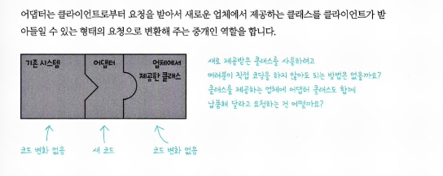

# 어댑터 패턴과 Facade 패턴

## 어댑터 패턴이란?

- 특정 클래스 인터페이스를 클라이언트에서 요구하는 다른 인터페이스로 변환하여 인터페이스가 호환되지 않아 같이 쓸 수 없었던 클래스를 사용할 수 있게 도와줌



- 클라이언트와 구현된 인터페이스를 분리할 수 있으며, 변경 내역이 어댑터에 캡슐화되어 나중에 인터페이스가 바뀌더라도 클라이언트를 바꿀 필요가 없음


- **Adaptee**
    - 인터페이스(메서드 모양)가 내가 원하는 형태가 아님
    - 보통 *수정하기 어렵거나* *수정하고 싶지 않은* 대상
- **Adapter**
    - 클라이언트가 기대하는 **Target 인터페이스**를 **구현**
    - 내부에서 **Adaptee를 호출**하면서 메서드/데이터를 **변환**해 줌
- Adaptee를 새로 바뀐 인터페이스로 감쌀 때는 객체 구성(Composition)을 사용한다. 이런 접근법은 어댑티의 모든 서브클래스에 어댑터를 쓸 수 있다는 장점이 있다.

## 객체 어댑터와 클래스 어댑터

> 7장에서는 객체 어댑터만 언급하고 있음. 클래스 어댑터는 다중상속이 필요한데, 자바는 다중상속이 되지 않기 때문에 클래스 다이어그램만 언급함
> 
- 객체 어댑터

```java
// Client가 기대하는 Target 인터페이스
interface Target {
    String request(String input);
}

// 이미 존재하는(수정하기 싫은) 클래스: Adaptee
class Adaptee {
    String specificRequest(byte[] data) {
        return "adaptee(" + new String(data) + ")";
    }
}

// Object Adapter(객체 어댑터): composition(합성) 사용
class ObjectAdapter implements Target {
    private final Adaptee adaptee; // <-- has-a

    ObjectAdapter(Adaptee adaptee) {
        this.adaptee = adaptee;
    }

    @Override
    public String request(String input) {
        // 필요한 변환 후, 내부 adaptee에 위임
        return adaptee.specificRequest(input.getBytes());
    }
}

// 사용 예
public class Demo {
    public static void main(String[] args) {
        Adaptee adaptee = new Adaptee();
        Target target = new ObjectAdapter(adaptee);
        System.out.println(target.request("hello"));
        // 출력: adaptee(hello)
    }
}
```

- 클래스 어댑터

```cpp
#include <string>
#include <iostream>

using std::string;
using std::cout;

class Target {
public:
    virtual string request(const string& input) = 0;
    virtual ~Target() = default;
};

class Adaptee {
public:
    string specificRequest(const string& raw) {
        return "Adaptee::specificRequest -> " + raw;
    }
};

class Adapter : public Target, public Adaptee {
public:
    string request(const string& input) override {
        string converted = "[converted]" + input;
        return specificRequest(converted);
    }
};

int main() {
    Target* t = new Adapter();
    cout << t->request("hello") << '\n';
    delete t;
}
```

## 실전 적용(Enumeration으로 Iterator에 적응시키기)

| **항목** | Enumeration | Iterator |
| --- | --- | --- |
| 세대 | 레거시(Java 1.0) | 표준 컬렉션(Java 1.2+) |
| 주 사용처 | Vector, Hashtable 등 | Collection 전반, Map의 keySet()/values()/entrySet() |
| 주요 메소드 | hasMoreElements(), nextElement() | hasNext(), next(), remove()(선택) |
| 삭제 | 지원 안 함 | remove()로 지원(가능한 컬렉션에 한함) |
| 권장 여부 | 레거시 호환용(새 코드 비권장) | 새 코드 권장(또는 for-each/Stream) |


- remove() 메소드 처리
    - Enumeration은 remove() 기능을 제공하지 않음
    - 어댑터 차원에서 완벽하게 작동하는 remove() 메소드 구현 방법은 없음
    - Iterator 인터페이스는 remove() 메소드르 구현할 때 UnsupportedOperationException을 지원하도록 만들었음
- 메소드가 일대일로 대응되지 않는 상황에서는 어댑터를 완벽하게 적용할 수 없음

```java
public class IteratorTest {

  @Test
  void iterator_adapter_test() {
    Vector<String> vector = new Vector<>();
    vector.add("1");
    vector.add("2");
    vector.add("3");
    
    IteratorAdapter<String> adapter = new IteratorAdapter<>(vector.elements());
    
    assertTrue(adapter.hasNext());
    assertEquals("1", adapter.next());
    assertEquals("2", adapter.next());
    assertEquals("3", adapter.next());
    assertFalse(adapter.hasNext());
    assertThrows(UnsupportedOperationException.class, adapter::remove);
  }

  @Test
  void enumeration_adapter_test() {
    List<String> list = List.of("1", "2", "3");
    EnumerationAdapter<String> adapter = new EnumerationAdapter<>(list.iterator());

    assertTrue(adapter.hasMoreElements());
    assertEquals("1", adapter.nextElement());
    assertEquals("2", adapter.nextElement());
    assertEquals("3", adapter.nextElement());
    assertFalse(adapter.hasMoreElements());
  }

  @RequiredArgsConstructor
  public static class IteratorAdapter<T> implements Iterator<T> {

    private final Enumeration<T> enumeration;

    @Override
    public boolean hasNext() {
      return enumeration.hasMoreElements();
    }

    @Override
    public T next() {
      return enumeration.nextElement();
    }

    @Override
    public void remove() {
      throw new UnsupportedOperationException();
    }
  }

  @RequiredArgsConstructor
  public static class EnumerationAdapter<T> implements Enumeration<T> {

    private final Iterator<T> iterator;

    @Override
    public boolean hasMoreElements() {
      return iterator.hasNext();
    }

    @Override
    public T nextElement() {
      return iterator.next();
    }
  }
}
```

# Facade 패턴

## Facade 이란?

- 쓰기 쉬운 인터페이스를 제공하는 Facade 클래스를 구현함으로써 복잡한 시스템을 훨씬 편리하게 사용할 수 있음
- 더 간단한 인터페이스를 만들 수 있다는 점 말고 또 다른 장점은?
    - 클라이언트 구현과 서브시스템을 분리할 수 있다.


## 사용 예제) 홈시어터


- Facade 패턴을 사용하면 간단하게 처리할 수 있다.

```java
@RequiredArgsConstructor
public class HomeTheaterFacade {

  private final Popper popper;
  private final Screen screen;
  private final Projector projector;
  private final Amplifier amp;
  private final StreamingPlayer player;
  private final TheaterLights lights;

  public void watchMovie(String movie) {
    // 팝콘 튀기기
    popper.on();
    popper.pop();
    // 조명 어둡게
    lights.dim(10);
    // 스크린 내림
    screen.down();
    // 프로젝터 설정
    projector.on();
    projector.wideScreenMode();
    // 앰프 설정
    amp.on();
    amp.setStreamingPlaer(player);
    amp.setSurroundSound();
    amp.setVolume(5);
    // 플레이어 설정
    player.on();
    player.play(movie);
  }

  public void endMovie() {
    // 팝콘 기계 끄기
    popper.off();
    // 조명 on
    lights.on();
    // 스크린 올림
    screen.up();
    // 프로젝터 끄기
    projector.off();
    // 앰프 끄기
    amp.off();
    // 플레이어 정지
    player.stop();
    player.off();
  }
}
```

## Facade VS 어댑터 패턴 차이

- Facade는 어떤 서브시스템에 대한 간단한 인터페이스를 제공하는 용도
- 어댑터는 인터페이스를 변경해서 클라이언트에서 필요로 하는 인터페이스로 적응시키는 용도

## Facade Pattern과 객체지향 원칙 준수

### 최소 지식 원칙

- 객체 사이의 상호작용은 될 수 있으면 아주 가까운 ‘친구’ 사이에서만 허용하는 편이 좋다.
- 친한친구들의 범위
    - 객체 자체
    - 파라미터로 받은 객체
    - 자기 필드(멤버 변수)
    - 메서드 안에서 새로 만든 객체

```java
// before
if (order.getCustomer().isVip()) { ... }

// after
if (order.isVipCustomer()) { ... }        // Order가 Customer에게 물어보도록 숨김
// 또는
if (customer.isVip()) { ... }             // customer가 이미 내 로컬이면 이건 괜찮음
```

```java
// before
order.getCustomer().getAddress().getZipCode();

// after
order.getZipCode(); // 내부에서 필요한 만큼만 탐색/계산
```

- Before와 같은 상황에서의 단점
    - 다른 객체의 일부분에 요청하게 되고, 직접적으로 알고 지내는 객체의 수가 늘어나게됨
    - 여러 클래스가 복잡하게 얽혀 있어, 시스템의 한 부분을 변경했을 때 다른 부분까지 줄줄이 고쳐야 할 상황이 생김
- 최소 지식 원칙의 단점
    - 잘 따르면 객체 사이의 의존성을 줄이고, 관리가 더 편해지는 장점은 있음
    - 적용하다 보면 메소드 호출을 처리하는 래퍼 클래스를 더 만들어야 할 수도 있어서 시스템이 복잡해지고, 개발 시간도 늘어나고, 성능도 떨어질 수 있음
- Client는 친구가 HomeTheaterFacade 하나밖에 없다.

