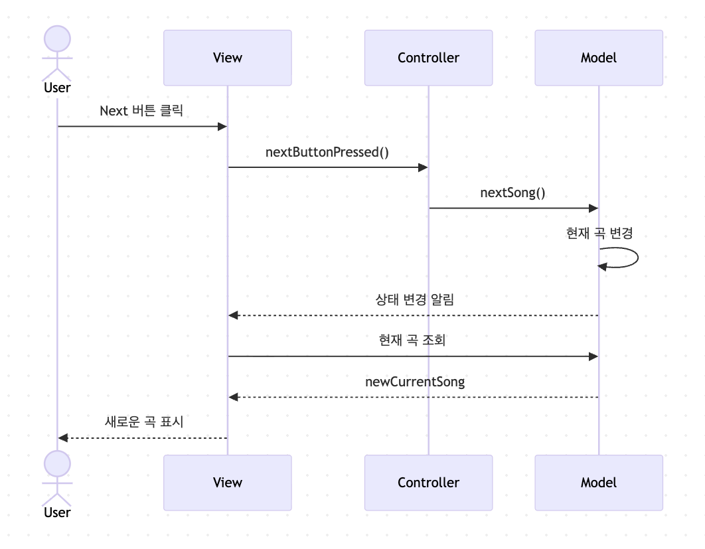

- 여러 패턴을 함께 사용해서 다양한 문제를 해결하는 방법을 복합 패턴이라고 함
    - 여러 패턴을 섞어서 쓰는 건 그냥 섞어 쓴거지 복합 패턴이 아니다.
    - 디자인 패턴을 쓰고 싶다고 억지로 적용하지 말고 반드시 상황에 맞게 사용하자.

## MVC(모델-뷰-컨트롤러)

<aside>
💡

- MVC를 이해할 때 가장 핵심적인 부분이 디자인 패턴이다.
- MVC는 여러 패턴을 합쳐 놓았다.
- MVC는 매우 강력한 복합 패턴이며, 잘 사용한다면 개발 시간을 획기적으로 줄여 줄 수 있다
</aside>

- 뷰
    - 모델을 표현하는 방법을 제공한다.
    - 화면에 표시할 때 필요한 상태와 데이터는 모델에서 직접 가져온다.
- 컨트롤러
    - 사용자로부터 입력을 받으며 입력받은 내용이 모델에게 어떤 의미가 있는지 파악
- 모델
    - 모든 데이터, 상태와 로직이 들어있음.
    - 뷰, 컨트롤러에서 모델의 상태를 조작, 조회 할 때 필요한 인터페이스를 제공, 자신의 상태 변화를 옵저버들에게 알려줌

### 사용되는 디자인 패턴들

- 모델
    - 옵저버 패턴
        - 모델은 상태가 변경되었을 때, 모델과 연관된 객체들에게 연락함.
        - 옵저버 패턴을 사용하면서 모델을 뷰와 컨트롤러부터 완전히 독립시킴
        - 한 모델에서 서로 다른 뷰를 사용할 수 있고, 여러 개의 뷰를 동시에 사용하는 것도 가능
- 뷰
    - 컴포지트 패턴
        - 디스플레이는 여러 단계로 겹쳐 있는 윈도우, 패널, 버튼, 텍스트 레이블 등으로 구성됨
        - 컨트롤러가 뷰에게 화면 갱신 요청 시, 최상위 뷰 구성 요소에게만 요청 하면 컴포지트 패턴이 처리함
- 컨트롤러
    - 전략 패턴
        - 컨트롤러는 전략을 제공하고 뷰는 Applicaiton의 겉모습에만 신경을 쓰고, 인터페이스의 행동을 결정하는 일은 모두 컨트롤러가 담당함
        - 전략 패턴을 사용해서 뷰를 모델로부터 분리함



### 좋은 예시 (GPT)

<aside>
💡

## 카페로 보는 복합 패턴

손님이 "아이스 아메리카노 한 잔 주세요" 라고 했을 때를 보면,

**캐셔 (Front Controller / Mediator)**
모든 주문을 한 곳에서 받아요. 손님은 바리스타한테 직접 말하지 않죠.

**주문서 (Command)**
"아이스 아메리카노, 샷 추가, 얼음 많이" 를 쪽지에 써서 전달해요. 주문을 객체로 캡슐화한 거예요.

**바리스타 (Strategy)**
음료 종류에 따라 다른 제조법을 씁니다. 에스프레소 머신 담당, 블렌더 담당으로 교체도 가능하죠.

**레시피 (Template Method)**
"컵 준비 → 얼음 → 에스프레소 → 물" 순서는 항상 고정이고, 세부 재료만 달라져요.

**진동벨 (Observer)**
음료가 완성되면 손님한테 자동으로 알려줘요. 손님이 카운터를 계속 쳐다볼 필요가 없죠.

**포인트 적립 (Proxy / Decorator)**
음료를 건네주면서 조용히 포인트가 쌓여요. 손님은 신경 쓸 필요 없어요.

</aside>

- 내부에서 패턴들이 알아서 협력하고, 손님(개발자)은 비즈니스 로직(주문)에만 집중하면 된다

### 나쁜 예시 (GPT)

1. 과도한 Singleton + Factory

```java
// 그냥 이렇게 쓰면 되는데
new UserService();

// 굳이 이렇게 만든다
SingletonFactory.getInstance()
    .getFactory("user")
    .createService("UserService");
```

- `UserService` 하나 만드는 데 Factory가 3겹. 객체 생성이 단순한데 패턴을 억지로 끼워넣음.
- 해결하는 문제가 없이 오히려 코드 추적이 더 어려워짐.

1. ViewModel 안에 Observer + Command + Strategy 전부

```java
class UserViewModel {
    // Observer로 상태 관찰하고
    // Command로 액션 처리하고
    // Strategy로 검증 로직 교체하고
    // Repository도 직접 들고 있고
    // 이벤트 발행도 여기서 하고...
}
```

|  | 좋은 복합 패턴 | 나쁜 복합 패턴 |
| --- | --- | --- |
| 패턴 추가 이유 | 실제 문제가 있어서 | 있어 보여서 |
| 복잡도 | 문제에 비례 | 문제보다 훨씬 높음 |
| 코드 추적 | 흐름이 명확 | 패턴 때문에 오히려 어려움 |
| 제거했을 때 | 문제가 다시 생김 | 오히려 코드가 깔끔해짐 |