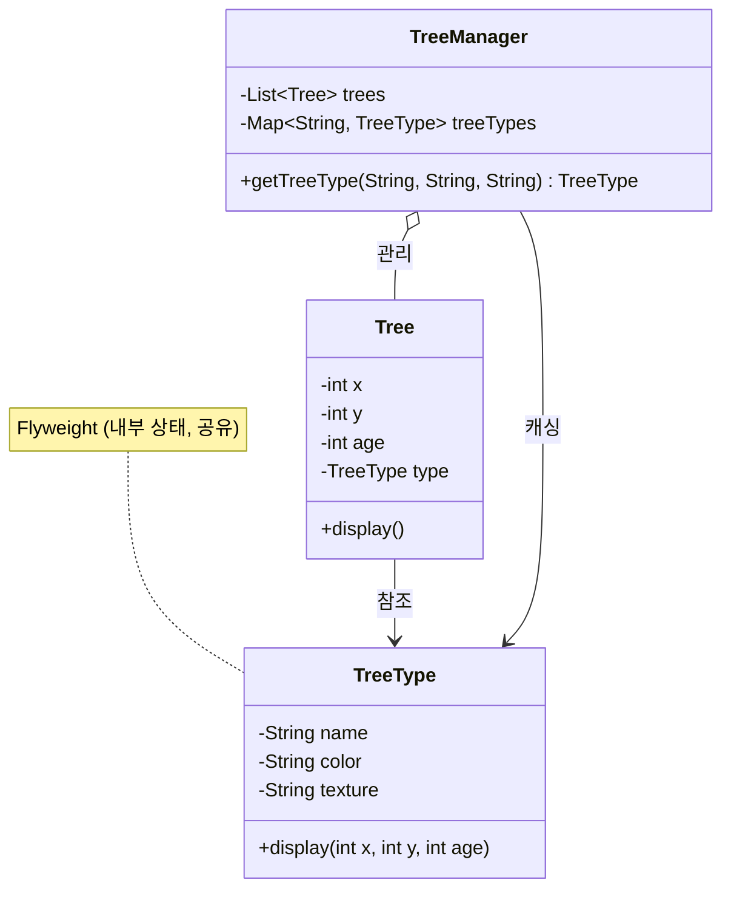

# Flyweight 패턴

## Flyweight 패턴이란?

- 어떤 클래스의 인스턴스 하나로 여러 개의 "가상 인스턴스"를 제공하고 싶을 때 사용하는 패턴
- 객체의 **내부 상태(intrinsic state)** 와 **외부 상태(extrinsic state)** 를 분리하여, 내부 상태를 공유함으로써 메모리 사용량을 크게 줄일 수 있음

## 핵심 개념

- **내부 상태 (Intrinsic State)**
    - 인스턴스 간에 공유할 수 있는 정보
    - Flyweight 객체 내부에 저장되며, 변하지 않는 값
    - 예: 나무의 종류(name), 색상(color), 텍스처(texture)
- **외부 상태 (Extrinsic State)**
    - 인스턴스마다 달라지는 정보
    - Flyweight 객체 외부에서 관리
    - 예: 나무의 좌표(x, y), 나이(age)

## 클래스 다이어그램



## 나무 예제

- 숲에 수천 그루의 나무를 심어야 한다고 가정
- 나무마다 종류(name), 색상(color), 텍스처(texture)를 개별적으로 저장하면 메모리 낭비가 심함
- Flyweight 패턴을 적용하면 동일한 종류의 나무는 `TreeType` 객체 하나를 공유하고, 좌표와 나이만 개별 `Tree` 객체에 저장

### Flyweight 적용 전

```
Tree 1: {name="소나무", color="초록", texture="pine.png", x=10, y=20, age=5}
Tree 2: {name="소나무", color="초록", texture="pine.png", x=30, y=40, age=3}
Tree 3: {name="소나무", color="초록", texture="pine.png", x=50, y=60, age=7}
→ "소나무" 관련 정보가 3번 중복 저장됨
```

### Flyweight 적용 후

```
TreeType: {name="소나무", color="초록", texture="pine.png"}  ← 1개만 존재 (공유)

Tree 1: {type=TreeType.소나무, x=10, y=20, age=5}
Tree 2: {type=TreeType.소나무, x=30, y=40, age=3}
Tree 3: {type=TreeType.소나무, x=50, y=60, age=7}
→ 내부 상태는 한 번만 저장, 외부 상태만 개별 저장
```

## Flyweight 패턴 활용

- Java의 `String` 상수 풀 (String Constant Pool)
- Java의 `Integer.valueOf()` -128~127 범위 캐싱
- 게임 개발에서 동일한 텍스처/모델을 공유하는 오브젝트
- 문서 편집기에서 글자(Character)의 글꼴/크기 정보 공유
