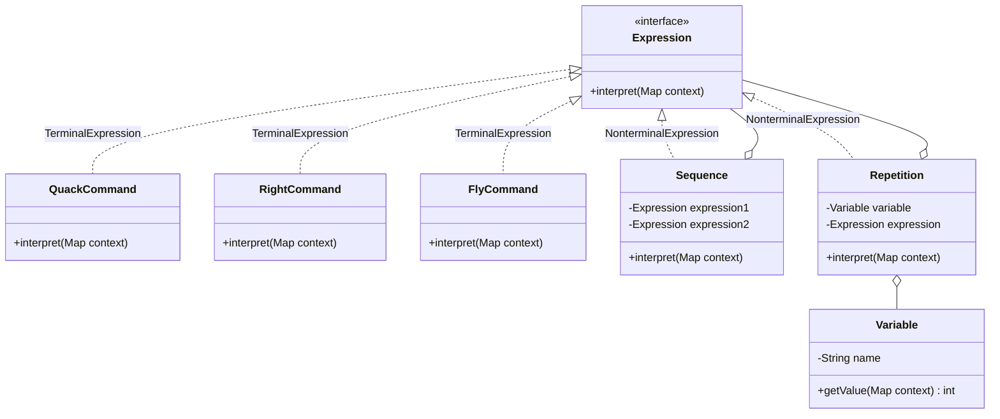

# 인터프리터 패턴

## 인터프리터 패턴이란?

- 언어의 문법을 클래스로 표현하고, 해당 언어로 작성된 문장을 해석(interpret)하는 패턴
- 각 문법 규칙을 하나의 클래스로 나타내며, 문장의 해석은 클래스의 `interpret()` 메서드 호출로 이루어짐
- 간단한 문법을 가진 언어를 해석할 때 유용하며, 문법이 복잡해지면 관리가 어려워질 수 있음

## 핵심 구성 요소

- **AbstractExpression (Expression)**
    - 모든 표현식이 구현해야 하는 `interpret()` 메서드를 정의하는 인터페이스
- **TerminalExpression (종료 표현식)**
    - 더 이상 분해되지 않는 최소 단위의 표현식
    - 예: `QuackCommand`, `RightCommand`, `FlyCommand`
- **NonterminalExpression (비종료 표현식)**
    - 다른 표현식을 포함하는 복합 표현식
    - 예: `Sequence` (두 표현식을 순서대로 실행), `Repetition` (표현식을 반복 실행)
- **Context**
    - 인터프리터에 전달되는 전역 정보 (변수 값 등)
    - 예: `Map<String, Integer>` — 변수 이름과 값을 매핑

## 클래스 다이어그램



## 오리 프로그래밍 언어 예제

오리에게 내릴 수 있는 명령을 간단한 언어로 정의하고, 인터프리터 패턴으로 해석한다.

### 문법 정의

```
program     ::= expression
expression  ::= command | sequence | repetition
command     ::= quack | right | fly
sequence    ::= expression expression
repetition  ::= variable expression    (변수 값만큼 expression 반복)
```

### 실행 예시

```java
// 컨텍스트: 변수 값 설정
Map<String, Integer> context = new HashMap<>();
context.put("quackCount", 3);
context.put("flyCount", 2);

// 프로그램: 꽥 3번 → 우회전 → 날기 2번
Expression program = new Sequence(
        new Repetition(new Variable("quackCount"), new QuackCommand()),
        new Sequence(
                new RightCommand(),
                new Repetition(new Variable("flyCount"), new FlyCommand())
        )
);

program.interpret(context);
```

### 실행 결과

```
꽥꽥!
꽥꽥!
꽥꽥!
오리가 오른쪽으로 방향을 틀었습니다.
오리가 날아갑니다!
오리가 날아갑니다!
```

- 컨텍스트의 변수 값만 바꾸면 동일한 프로그램 구조에서 다른 결과를 얻을 수 있음

## 인터프리터 패턴 활용

- 정규 표현식 엔진: 패턴 문법을 해석하여 문자열 매칭 수행
- SQL 파서: SQL 쿼리 문법을 해석하여 데이터 조회
- 수식 계산기: 사칙연산 문법을 해석하여 결과 계산
- 로봇/게임 캐릭터 스크립트: 간단한 명령어를 해석하여 동작 수행 (이 예제와 유사)

## 장단점

- **장점**: 문법을 클래스로 표현하므로 문법 변경/확장이 쉬움 (새로운 Command 클래스 추가만 하면 됨)
- **단점**: 문법 규칙이 많아지면 클래스 수가 급격히 증가하여 관리가 복잡해짐. 이 경우 파서/컴파일러 도구 사용을 고려
