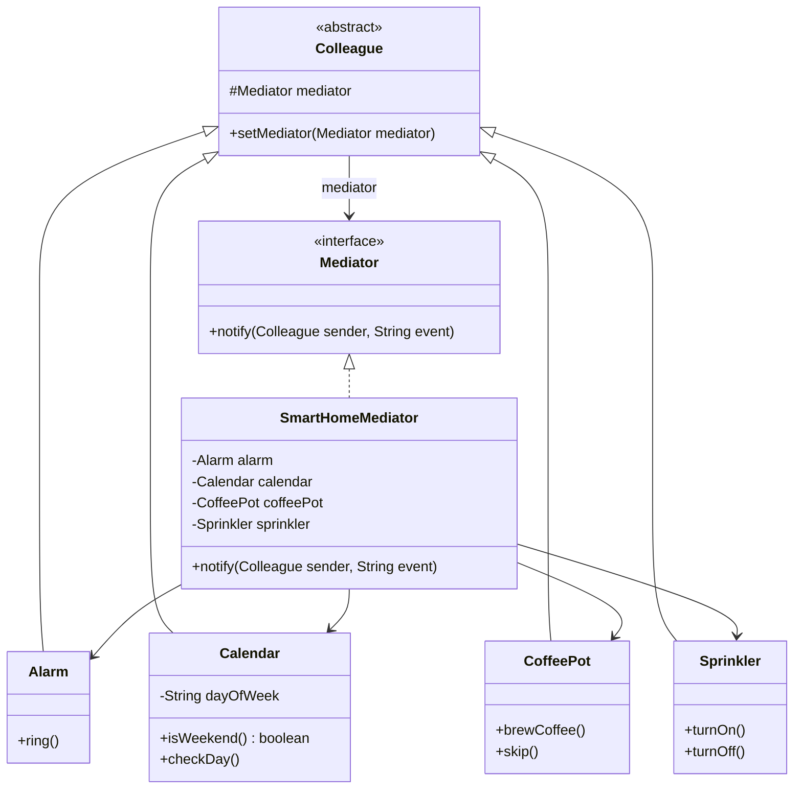

# 중재자(Mediator) 패턴

## 중재자 패턴이란?

- 서로 관련된 객체 사이의 복잡한 통신과 제어를 한 곳으로 집중시키는 패턴
- 객체들이 서로 직접 참조하지 않고, **중재자(Mediator)** 를 통해서만 통신하여 결합도를 낮춤
- 시스템에 들어가는 객체(Colleague) 사이에서 연락을 책임지는 객체를 하나 추가하여 M:N 관계를 1:N 관계로 바꿔줌

## 핵심 구성 요소

- **Mediator**
    - Colleague 객체 간의 통신을 조율하는 인터페이스
- **ConcreteMediator (SmartHomeMediator)**
    - Colleague 간의 상호작용 로직을 구현
    - 모든 Colleague를 알고 있으며, 이벤트에 따라 적절한 Colleague에 명령을 보냄
- **Colleague**
    - Mediator를 통해 다른 Colleague와 통신하는 객체들의 기반 클래스
    - 예: `Alarm`, `Calendar`, `CoffeePot`, `Sprinkler`

## 클래스 다이어그램



## 자동화 주택 예제

### 중재자 패턴 적용 전 — 객체 간 직접 참조

각 기기가 다른 기기를 직접 호출하여 강하게 결합되어 있음

```java
// Alarm이 Calendar, Sprinkler, CoffeePot을 직접 참조
public class Alarm {
    public void onEvent() {
        checkCalendar();
        checkSprinkler();
        startCoffee();
    }
}

// CoffeePot도 Calendar, Alarm을 직접 참조
public class CoffeePot {
    public void onEvent() {
        checkCalendar();
        checkAlarm();
    }
}
```

- 기기가 추가될수록 서로의 참조가 기하급수적으로 늘어남
- 하나의 기기를 수정하면 다른 기기에도 영향을 줌

### 중재자 패턴 적용 후 — Mediator를 통한 통신

```java
// Alarm은 Mediator에게만 알림
public class Alarm extends Colleague {
    public void ring() {
        System.out.println("[알람] 알람이 울렸습니다!");
        mediator.notify(this, "alarm");
    }
}

// Mediator가 모든 조율을 담당
public class SmartHomeMediator implements Mediator {
    @Override
    public void notify(Colleague sender, String event) {
        if (event.equals("alarm")) {
            calendar.checkDay();
            if (calendar.isWeekend()) {
                coffeePot.skip();       // 주말에는 커피를 끓이지 않음
                sprinkler.turnOff();
            } else {
                coffeePot.brewCoffee(); // 평일에는 커피를 끓임
                sprinkler.turnOn();
            }
        }
    }
}
```

### 실행 결과

```
=== 평일 아침 시나리오 ===
[알람] 알람이 울렸습니다!
[캘린더] 오늘은 월요일입니다. (주말: false)
[커피메이커] 커피를 내리기 시작합니다.
[스프링클러] 잔디밭에 물을 뿌립니다.

=== 주말 아침 시나리오 ===
[알람] 알람이 울렸습니다!
[캘린더] 오늘은 토요일입니다. (주말: true)
[커피메이커] 주말이라 커피를 끓이지 않습니다.
[스프링클러] 스프링클러를 끕니다.
```

## 중재자 패턴 활용

- 채팅방: 사용자 간 메시지를 채팅방(Mediator)이 중재
- UI 폼 검증: 여러 입력 필드의 상호작용을 폼 컨트롤러(Mediator)가 조율
- 항공 관제탑: 비행기 간 통신을 관제탑(Mediator)이 중재
- 이벤트 버스: 컴포넌트 간 이벤트를 이벤트 버스(Mediator)가 전달

## 장단점

- **장점**: Colleague 간의 결합도를 낮추고, 상호작용 로직을 Mediator에 집중시켜 이해와 수정이 쉬워짐
- **단점**: Mediator에 로직이 집중되어 Mediator 자체가 복잡해질 수 있음 (God Object 위험)
