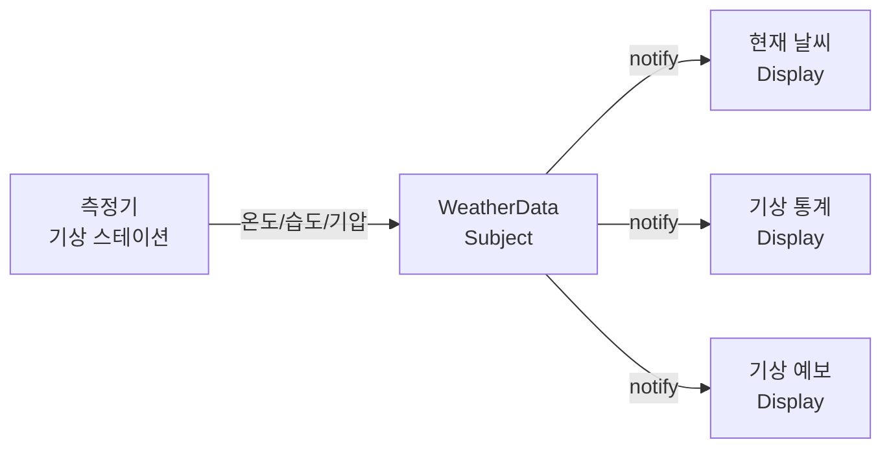
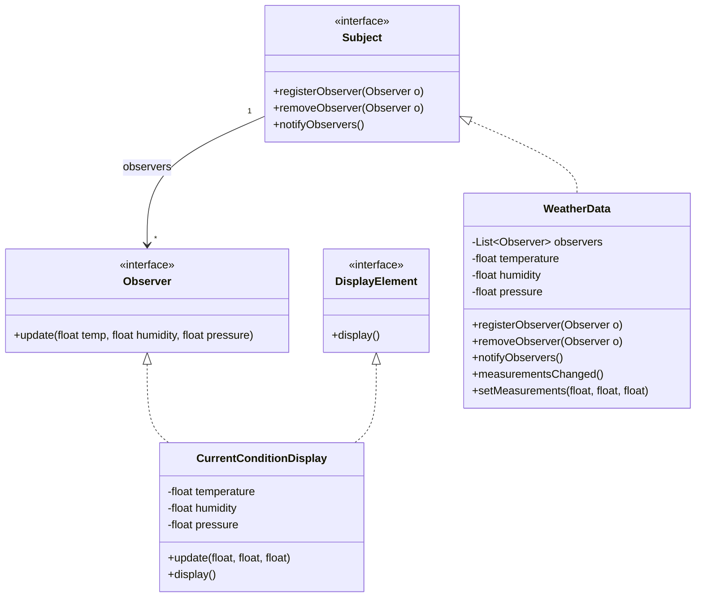
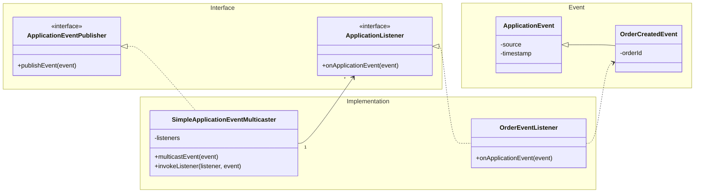

# Observer Pattern

## 개요

한 객체의 상태가 변경되면 그 객체에 의존하는 모든 객체들이 자동으로 알림을 받고 갱신되는 패턴이다.

**핵심 특징**
- One-to-Many 의존 관계
- 느슨한 결합 (Loose Coupling)
- 런타임에 동적으로 옵저버 추가/제거 가능

---

## 기상 모니터링 애플리케이션

### 요구사항



**동작 흐름**
1. 측정기에서 온도, 습도, 기압 데이터를 측정
2. WeatherData 객체가 측정 데이터를 수신
3. WeatherData가 등록된 모든 디스플레이에 변경 사항을 통지
4. 각 디스플레이가 자신의 화면을 갱신

---

### 문제가 있는 구현

```java
public class WeatherData {
    private Double temperature;
    private Double humidity;
    private Double pressure;

    public void measurementsChanged(Double temperature, Double humidity, Double pressure) {
        this.temperature = temperature;
        this.humidity = humidity;
        this.pressure = pressure;

        // 디스플레이 갱신 - 디스플레이가 추가될 때마다 이 코드도 수정해야 한다
        currentConditionDisplay.update(temperature, humidity, pressure);
        statisticsDisplay.update(temperature, humidity, pressure);
        forecastDisplay.update(temperature, humidity, pressure);
    }
}
```

**문제점**

| 문제 | 설명 |
|------|------|
| OCP 위반 | 디스플레이 추가/제거 시 코드 수정 필요 |
| 캡슐화 부족 | 변경되는 부분이 캡슐화되지 않음 |
| 유연성 부족 | 실행 중에 디스플레이 항목 추가/제거 불가 |
| DIP 위반 | 인터페이스가 아닌 구체적인 구현에 의존 |

---

## 옵저버 패턴 적용 설계

### 클래스 다이어그램



---

## 구현 코드 - Push 방식

Subject가 모든 데이터를 Observer에게 전달하는 방식이다.

### 인터페이스

**Subject.java**
```java
public interface Subject {
    void registerObserver(Observer o);
    void removeObserver(Observer o);
    void notifyObservers();
}
```

**Observer.java**
```java
public interface Observer {
    void update(float temp, float humidity, float pressure);
}
```

**DisplayElement.java**
```java
public interface DisplayElement {
    void display();
}
```

### 구현 클래스

**WeatherData.java**
```java
import java.util.ArrayList;
import java.util.List;

public class WeatherData implements Subject {
    List<Observer> observers;
    private float temperature, humidity, pressure;

    public WeatherData() {
        observers = new ArrayList<Observer>();
    }

    @Override
    public void registerObserver(Observer o) {
        observers.add(o);
    }

    @Override
    public void removeObserver(Observer o) {
        observers.remove(o);
    }

    @Override
    public void notifyObservers() {
        observers.forEach(observer -> observer.update(temperature, humidity, pressure));
    }

    public void measurementsChanged() {
        notifyObservers();
    }

    public void setMeasurements(float temperature, float humidity, float pressure) {
        this.temperature = temperature;
        this.humidity = humidity;
        this.pressure = pressure;
        measurementsChanged();
    }
}
```

**CurrentConditionDisplay.java**
```java
public class CurrentConditionDisplay implements Observer, DisplayElement {
    private float temperature;
    private float humidity;
    private float pressure;

    public CurrentConditionDisplay() {
    }

    @Override
    public void display() {
        System.out.printf("--Current Condition--\n");
        System.out.printf("Current temperature: %f\n", temperature);
        System.out.printf("Current humidity: %f\n", humidity);
        System.out.printf("Current pressure: %f\n", pressure);
    }

    @Override
    public void update(float temp, float humidity, float pressure) {
        this.temperature = temp;
        this.humidity = humidity;
        this.pressure = pressure;
        display();
    }
}
```

### 실행 클래스

**WeatherStation.java**
```java
public class WeatherStation {
    public static void main(String[] args) {
        WeatherData weatherData = new WeatherData();

        CurrentConditionDisplay currentConditionDisplay = new CurrentConditionDisplay();
        weatherData.registerObserver(currentConditionDisplay);

        weatherData.setMeasurements(60, 80, 40);
        weatherData.setMeasurements(10, 30, 10);
        weatherData.setMeasurements(50, 8, 20);
    }
}
```

**실행 결과**
```
--Current Condition--
Current temperature: 60.000000
Current humidity: 80.000000
Current pressure: 40.000000
--Current Condition--
Current temperature: 10.000000
Current humidity: 30.000000
Current pressure: 10.000000
--Current Condition--
Current temperature: 50.000000
Current humidity: 8.000000
Current pressure: 20.000000
```

---

## 구현 코드 - Pull 방식

Observer가 Subject 참조를 통해 필요한 데이터만 가져오는 방식이다.

### 인터페이스

**Subject.java**
```java
public interface Subject {
    void registerObserver(Observer o);
    void removeObserver(Observer o);
    void notifyObservers();
}
```

**Observer.java**
```java
public interface Observer {
    void update();
}
```

**DisplayElement.java**
```java
public interface DisplayElement {
    void display();
}
```

### 구현 클래스

**WeatherData.java**
```java
import java.util.ArrayList;
import java.util.List;

public class WeatherData implements Subject {
    List<Observer> observers;
    private float temperature, humidity, pressure;

    public WeatherData() {
        observers = new ArrayList<Observer>();
    }

    @Override
    public void registerObserver(Observer o) {
        observers.add(o);
    }

    @Override
    public void removeObserver(Observer o) {
        observers.remove(o);
    }

    @Override
    public void notifyObservers() {
        observers.forEach(Observer::update);
    }

    public void measurementsChanged() {
        notifyObservers();
    }

    public void setMeasurements(float temperature, float humidity, float pressure) {
        this.temperature = temperature;
        this.humidity = humidity;
        this.pressure = pressure;
        measurementsChanged();
    }

    // Getter 메서드 - Observer가 필요한 데이터만 가져갈 수 있음
    public float getTemperature() {
        return temperature;
    }

    public float getHumidity() {
        return humidity;
    }

    public float getPressure() {
        return pressure;
    }
}
```

**CurrentConditionDisplay.java**
```java
public class CurrentConditionDisplay implements Observer, DisplayElement {
    private float temperature;
    private float humidity;
    private final WeatherData weatherData;

    public CurrentConditionDisplay(WeatherData weatherData) {
        this.weatherData = weatherData;
    }

    @Override
    public void display() {
        System.out.printf("--Current Condition--\n");
        System.out.printf("Current temperature: %f\n", temperature);
        System.out.printf("Current humidity: %f\n", humidity);
    }

    @Override
    public void update() {
        // 필요한 데이터만 가져옴 (pressure는 사용하지 않음)
        this.temperature = weatherData.getTemperature();
        this.humidity = weatherData.getHumidity();
        display();
    }
}
```

### 실행 클래스

**WeatherStation.java**
```java
public class WeatherStation {
    public static void main(String[] args) {
        WeatherData weatherData = new WeatherData();

        CurrentConditionDisplay currentConditionDisplay = new CurrentConditionDisplay(weatherData);
        weatherData.registerObserver(currentConditionDisplay);

        weatherData.setMeasurements(60, 80, 40);
        weatherData.setMeasurements(10, 30, 10);
        weatherData.setMeasurements(50, 8, 20);
    }
}
```

**실행 결과**
```
--Current Condition--
Current temperature: 60.000000
Current humidity: 80.000000
--Current Condition--
Current temperature: 10.000000
Current humidity: 30.000000
--Current Condition--
Current temperature: 50.000000
Current humidity: 8.000000
```

---

## Push vs Pull 비교

| 구분 | Push 방식 | Pull 방식 |
|------|-----------|-----------|
| 데이터 전달 | Subject가 모든 데이터를 전달 | Observer가 필요한 데이터만 요청 |
| Observer 인터페이스 | update(temp, humidity, pressure) | update() |
| Subject 의존성 | Observer가 Subject를 몰라도 됨 | Observer가 Subject 참조 필요 |
| 유연성 | 모든 Observer가 같은 데이터 수신 | Observer별로 다른 데이터 사용 가능 |
| 적합한 상황 | 모든 Observer가 동일한 데이터 필요 시 | Observer별 필요 데이터가 다를 때 |

---

## 설계 원칙

| 원칙 | 적용 |
|------|------|
| 느슨한 결합 | Subject와 Observer가 인터페이스로만 통신 |
| OCP | 새로운 Observer 추가 시 Subject 코드 수정 불필요 |
| DIP | 구체 클래스가 아닌 인터페이스에 의존 |

---

## 실제 사례: Spring Framework Event System

Spring Framework는 Observer 패턴을 이벤트 시스템으로 구현하여 사용한다.

### 구조 매핑

| Observer 패턴 | Spring Event System |
|---------------|---------------------|
| Subject | ApplicationEventPublisher |
| Observer | ApplicationListener |
| notify() | publishEvent() |
| update() | onApplicationEvent() |

### 클래스 다이어그램



### 인터페이스

**ApplicationEventPublisher.java** - Subject 역할
- [GitHub 링크](https://github.com/spring-projects/spring-framework/blob/main/spring-context/src/main/java/org/springframework/context/ApplicationEventPublisher.java)

```java
@FunctionalInterface
public interface ApplicationEventPublisher {

    default void publishEvent(ApplicationEvent event) {
        publishEvent((Object) event);
    }

    void publishEvent(Object event);
}
```

**ApplicationListener.java** - Observer 역할
- [GitHub 링크](https://github.com/spring-projects/spring-framework/blob/main/spring-context/src/main/java/org/springframework/context/ApplicationListener.java)

```java
@FunctionalInterface
public interface ApplicationListener<E extends ApplicationEvent> extends EventListener {

    void onApplicationEvent(E event);

    default boolean supportsAsyncExecution() {
        return true;
    }
}
```

### 구현 클래스

**SimpleApplicationEventMulticaster.java** - 이벤트 멀티캐스터
- [GitHub 링크](https://github.com/spring-projects/spring-framework/blob/main/spring-context/src/main/java/org/springframework/context/event/SimpleApplicationEventMulticaster.java)

```java
public class SimpleApplicationEventMulticaster extends AbstractApplicationEventMulticaster {

    @Override
    public void multicastEvent(ApplicationEvent event, @Nullable ResolvableType eventType) {
        ResolvableType type = (eventType != null ? eventType : ResolvableType.forInstance(event));
        Executor executor = getTaskExecutor();
        for (ApplicationListener<?> listener : getApplicationListeners(event, type)) {
            if (executor != null && listener.supportsAsyncExecution()) {
                try {
                    executor.execute(() -> invokeListener(listener, event));
                }
                catch (RejectedExecutionException ex) {
                    invokeListener(listener, event);
                }
            }
            else {
                invokeListener(listener, event);
            }
        }
    }

    protected void invokeListener(ApplicationListener<?> listener, ApplicationEvent event) {
        ErrorHandler errorHandler = getErrorHandler();
        if (errorHandler != null) {
            try {
                doInvokeListener(listener, event);
            }
            catch (Throwable err) {
                errorHandler.handleError(err);
            }
        }
        else {
            doInvokeListener(listener, event);
        }
    }
}
```

### 사용 예시

**커스텀 이벤트 정의**
```java
public class OrderCreatedEvent extends ApplicationEvent {
    private final String orderId;

    public OrderCreatedEvent(Object source, String orderId) {
        super(source);
        this.orderId = orderId;
    }

    public String getOrderId() {
        return orderId;
    }
}
```

**이벤트 리스너 구현**
```java
@Component
public class OrderEventListener implements ApplicationListener<OrderCreatedEvent> {

    @Override
    public void onApplicationEvent(OrderCreatedEvent event) {
        System.out.println("주문 생성됨: " + event.getOrderId());
        // 이메일 발송, 재고 감소 등 후속 처리
    }
}
```

**이벤트 발행**
```java
@Service
public class OrderService {
    private final ApplicationEventPublisher eventPublisher;

    public OrderService(ApplicationEventPublisher eventPublisher) {
        this.eventPublisher = eventPublisher;
    }

    public void createOrder(String orderId) {
        // 주문 생성 로직
        eventPublisher.publishEvent(new OrderCreatedEvent(this, orderId));
    }
}
```

### 어노테이션 기반 리스너

Spring 4.2부터는 `@EventListener` 어노테이션으로 더 간단하게 구현 가능하다.

```java
@Component
public class OrderEventHandler {

    @EventListener
    public void handleOrderCreated(OrderCreatedEvent event) {
        System.out.println("주문 생성됨: " + event.getOrderId());
    }

    @EventListener
    @Async
    public void handleOrderCreatedAsync(OrderCreatedEvent event) {
        // 비동기 처리
        System.out.println("비동기 처리: " + event.getOrderId());
    }
}
